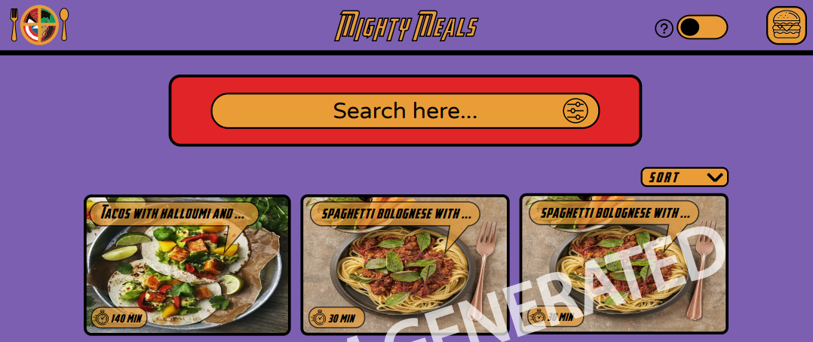
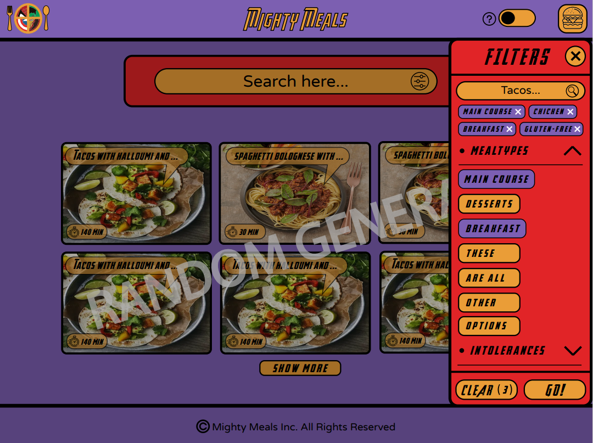
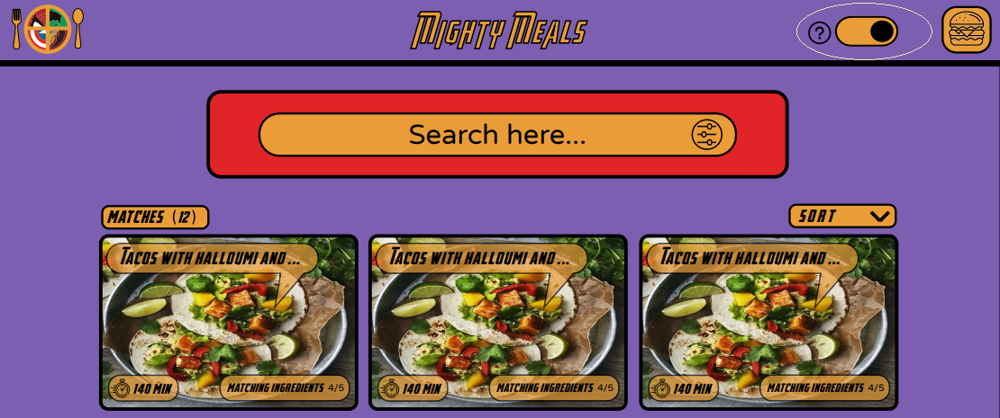

# Mighty Meals

## Mighty Meals

Want to spend quality time with your kids while cooking together? Need inspiration for what to make? Maybe you’d like to see what you can cook with the ingredients you have at hand? Then this is the app for you!

Mighty Meals is a recipe app with superhero theme specifically aimed for adults cooking with children, but can be used by any superhero fan, or just anyone who would love a fantastic food app that is unlike any other.
 
We hope you have a marvelous time cooking with us! 

## Demo
Here is how the app looks: 

 
Use the `search bar` to search for a dish or click the `filter` button in the search bar to apply filters for meal types, cuisines, intolerances, diets and ingredients:

 
Click the `switch` button next to the menu in the top right corner to switch between default mode and a mode that enables recipe search based on ingredients you have at hand:
 
 

## Features

- At a later stage we can add the features that make our app unique.

## How to run:

1. Clone the repository.
2. Install the dependencies.
3. Run the project.

 

